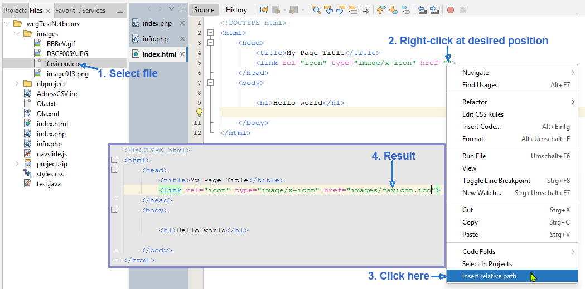

# Relative Path Inserter for Apache NetBeans

A lightweight Apache NetBeans plugin to insert relative file paths into editor text.

## Features
- Insert relative path of a selected file directly at the current cursor position in editor
- Replace selected text with a relative path
- Integrated into the NetBeans context menu
- Fast and lightweight
- Designed for Apache NetBeans 30
  
  
## Installation
### Install from NBM File

1. Download the latest `.nbm` file from the [Releases page](https://github.com/PUS234/RelativePathInserter/releases/latest)
2. Open Apache NetBeans
3. Go to: Tools -> Plugins -> Downloaded -> Add Plugins…
4. Select the downloaded .nbm file
5. Click Install

## Usage
Open a project in Apache NetBeans  
### Insert Relative Path

1.	Select a file in the Projects or Files window
2.	Right-click at the desired position in the editor
3.	Click ‚Insert relative path‘

### Replace Selected Text
If text is selected in the editor, the selected text will be replaced with the generated relative path.

## Compatibility
•	Apache NetBeans 30   
•	Java 24+   
•	Windows tested  
## Source Code
GitHub Repository:
https://github.com/PUS234/RelativePathInserter
## License
MIT License  
See the LICENSE file for details.

